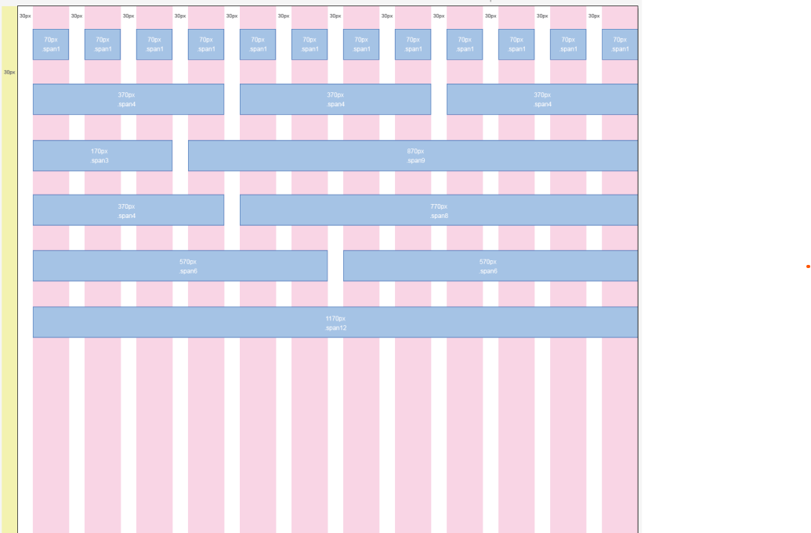
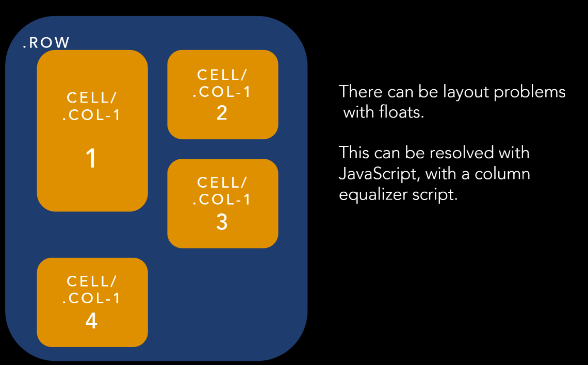
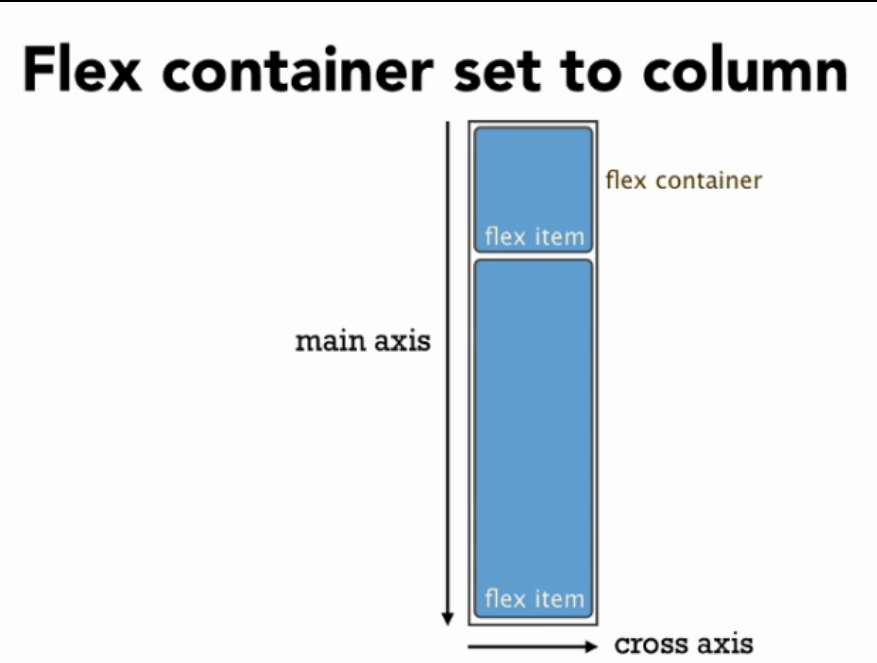
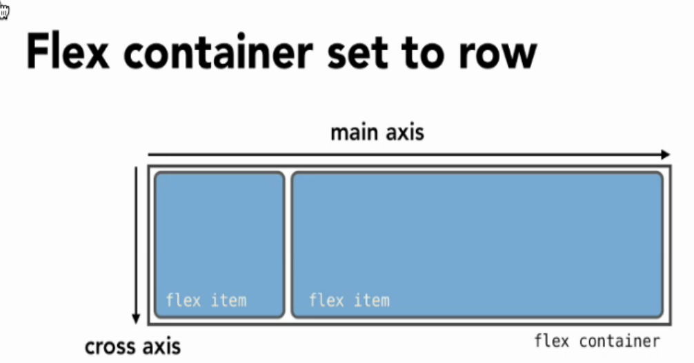

# Frontend Masters: CSS Grids and Flexbox in Responsive Web Design workshop files

Taught October 3-4, 2017, at Frontend Masters

Course is located here: https://frontendmasters.com/courses/css-grids-flexbox/

- [Code & Slides](https://github.com/jen4web/fem-layout/)

## Introduction

### Responsive Design

#### Flexible grid-based layout

#### Media queries (CSS3)

- Browser reports screen resolution
- Based on current width, serve a stylesheet with layout for that width
- No Javascript involved

#### Images that resize

Images should change size, based on your screen resolution.

Solutions available client side and server side, including new `<picture>` tag

## Floats

Float is a hack, it where intended to do was float an image on a web page and wrap the text around it. It was not intended to layout whole web pages.

They have rows and cells

IF YOU FLOAT YOU MUST CLEAR

Source ordering determines display. Somoe rearrangement is possible.

Major disadvantage: equal column heights

### clear

> The clear CSS property sets whether an element must be moved below (cleared) floating elements that precede it. The clear property applies to floating and non-floating elements.

A common pattern is to clear the ::after pseudo-element of a row and add a block display

## Flexbox

There's a parent and a child. The parent is called the flex container (row) and the child is called the flex item (cells).

Flexbox works in 1 dimension!

- **main axis**: matches the direction of that flex container
- **cross axis**

### Three versions of flexbox

- 2009: display: box;
- 2011: display: flexbox; (IE 10)
- 2016: display: flex;

Prefixing may still be required depending on browser support desired

### Parent

- **justify-content**: determines the distribution of the flex-items within the flex-container on the main axis. If flex-direction is row, then horizontal is the main axis. When flex-direction is column, then column is the main axis.
- **align-items**: This aligns our items on the cross axis

### Children

- **flex-basis**: is analogous to width, but not quite the same thing. Width is an absolute measurement — an element is that wide, all the time. We can measure width in relative units (say 25% instead of 250px), but in the end, the measurement itself never changes. For flex-basis, we try to achieve a given width with the space available. It could be smaller than this width, or it could be wider, depending on the extra space and how that’s supposed to be distributed. Distribution of extra space is controlled by flex-grow and flex-shrink (below). DO NOT USE THE WIDTH PROPERTY ON FLEX ITEMS. Default to auto.

- **flex-grow**: This property specifies how much of the remaining space in the flex container should be assigned to the item (the flex grow factor). Default to 0.

- **flex-shrink**: sets the flex shrink factor of a flex item. If the size of all flex items is larger than the flex container, items shrink to fit according to flex-shrink. Default to 1.

- **flex** <'flex-grow'> <'flex-shrink'>? || <'flex-basis'>

