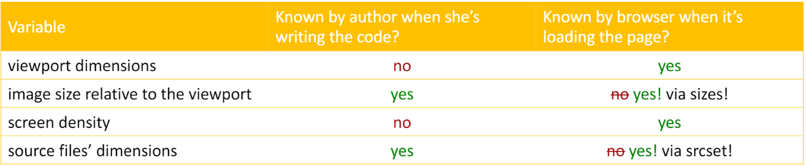
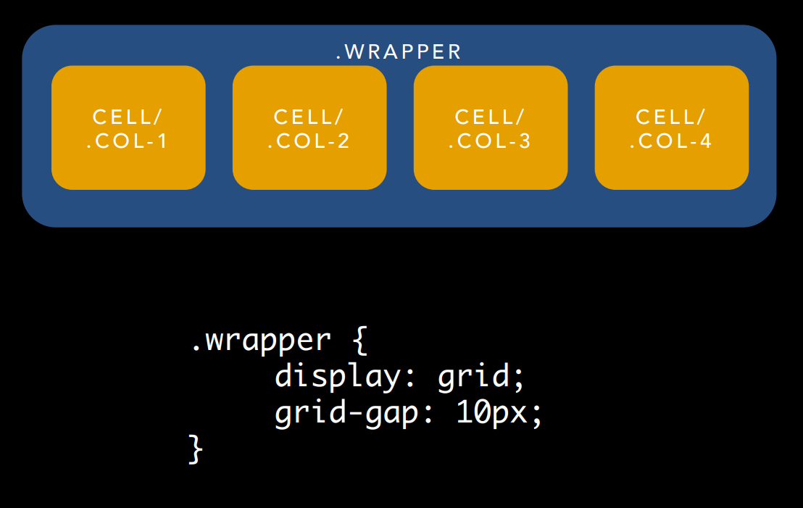
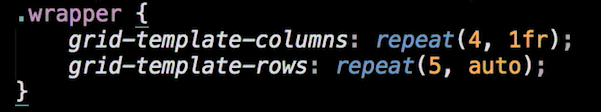
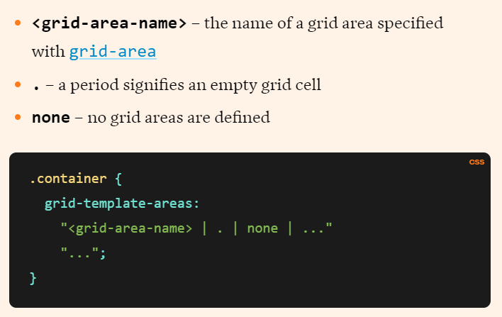
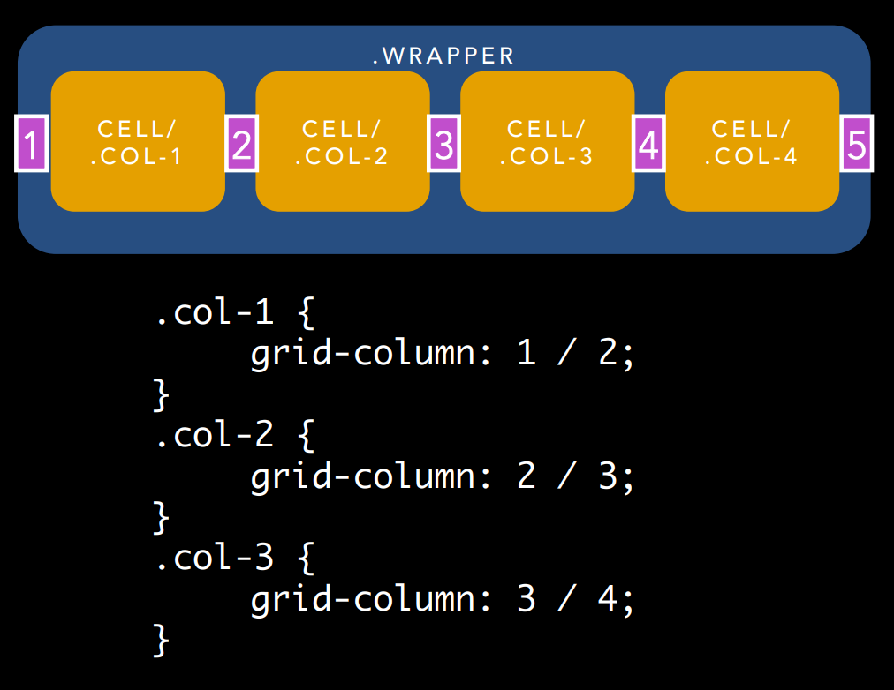
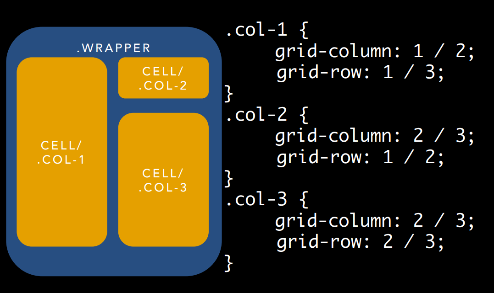

# Frontend Masters: CSS Grids and Flexbox in Responsive Web Design workshop files

- [Frontend Masters: CSS Grids and Flexbox in Responsive Web Design workshop files](#frontend-masters-css-grids-and-flexbox-in-responsive-web-design-workshop-files)
  - [v1](#v1)
  - [v2](#v2)
  - [Introduction](#introduction)
    - [Responsive Design](#responsive-design)
      - [Flexible grid-based layout](#flexible-grid-based-layout)
      - [Media queries (CSS3)](#media-queries-css3)
      - [Images that resize](#images-that-resize)
  - [Floats](#floats)
    - [clear](#clear)
  - [Flexbox](#flexbox)
    - [Three versions of flexbox](#three-versions-of-flexbox)
    - [Parent](#parent)
    - [Children](#children)
  - [Responsive Images](#responsive-images)
    - [`<picture />` tag](#picture--tag)
    - [srcset and sizes](#srcset-and-sizes)
      - [Picturefill](#picturefill)
      - [Performance](#performance)
  - [CSS Grid](#css-grid)
    - [Polyfills & Fallbacks](#polyfills--fallbacks)
    - [Syntax](#syntax)
      - [Container](#container)
      - [Items](#items)
    - [Alternate Syntax](#alternate-syntax)
    - [Reordering](#reordering)
    - [Implicit Grid](#implicit-grid)
  - [Overlap elements](#overlap-elements)
    - [Absolute and Relative position](#absolute-and-relative-position)
    - [Grid](#grid)

## v1

Taught October 3-4, 2017, at Frontend Masters

Course is located here: [https://frontendmasters.com/courses/css-grids-flexbox/]

- [Code & Slides](https://github.com/jen4web/fem-layout/)

## v2

- [Course Link](https://frontendmasters.com/courses/css-grid-flexbox-v2/)
- [Github Repo](https://github.com/FrontendMasters/grid-flexbox-v2)
- [Course Website](https://frontendmasters.github.io/grid-flexbox-v2/)

## Introduction

### Responsive Design

#### Flexible grid-based layout


#### Media queries (CSS3)

- Browser reports screen resolution
- Based on current width, serve a stylesheet with layout for that width
- No Javascript involved

#### Images that resize

Images should change size, based on your screen resolution.

Solutions available client side and server side, including new `<picture>` tag

## Floats

Float is a hack, it where intended to do was float an image on a web page and wrap the text around it. It was not intended to layout whole web pages.

They have rows and cells

IF YOU FLOAT YOU MUST CLEAR

Source ordering determines display. Somoe rearrangement is possible.

Major disadvantage: equal column heights


### clear

> The clear CSS property sets whether an element must be moved below (cleared) floating elements that precede it. The clear property applies to floating and non-floating elements.

A common pattern is to clear the ::after pseudo-element of a row and add a block display

## Flexbox

There's a parent and a child. The parent is called the flex container (row) and the child is called the flex item (cells).

Flexbox works in 1 dimension!

- **main axis**: matches the direction of that flex container
- **cross axis**


### Three versions of flexbox

- 2009: display: box;
- 2011: display: flexbox; (IE 10)
- 2016: display: flex;

Prefixing may still be required depending on browser support desired

### Parent

- **justify-content**: determines the distribution of the flex-items within the flex-container on the main axis. If flex-direction is row, then horizontal is the main axis. When flex-direction is column, then column is the main axis.
- **align-items**: This aligns our items on the cross axis
- **gap**: is a shorthand for `row-gap` and `column-gap`, specifying the size of gutters, which is the space between rows and columns within grid, flex, and multi-column layouts

### Children

- **flex-basis**: is analogous to width, but not quite the same thing. Width is an absolute measurement — an element is that wide, all the time. We can measure width in relative units (say 25% instead of 250px), but in the end, the measurement itself never changes. For flex-basis, we try to achieve a given width with the space available. It could be smaller than this width, or it could be wider, depending on the extra space and how that’s supposed to be distributed. Distribution of extra space is controlled by flex-grow and flex-shrink (below). DO NOT USE THE WIDTH PROPERTY ON FLEX ITEMS. Default to auto.

- **flex-grow**: This property specifies how much of the remaining space in the flex container should be assigned to the item (the flex grow factor). Default to 0.

- **flex-shrink**: sets the flex shrink factor of a flex item. If the size of all flex items is larger than the flex container, items shrink to fit according to flex-shrink. Default to 1.

- **flex** <'flex-grow'> <'flex-shrink'>? || <'flex-basis'>

## Responsive Images

- Images should change size based on screen resolution
  - Load a big image and let it scale (not good)
  - Server-side (good)
  - Client-side: Load several images and display the right for this resolution (not good)
  - Client-side: let JavaScript decide (better)

### `<picture />` tag

- Picturefill polyfill can help backwards compatibility
- List images with the `<resource />` tag
- Use `` tag for default behavior and image properties (alt)

```html
<picture>
  <source
    srcset="/media/cc0-images/surfer-240-200.jpg"
    media="(min-width: 800px)"
  />
  
</picture>
```

[Using the viewport meta tag to control layout on mobile browsers](https://developer.mozilla.org/en-US/docs/Web/HTML/Viewport_meta_tag)

### srcset and sizes

[Srcset and sizes](https://ericportis.com/posts/2014/srcset-sizes/)

The browser will decide which image to load, even if it's not the best option or the image you expect. Different browsers may make different choices.



```html

```

```html
<meta name="viewport" content="width=device-width, initial-scale=1.0" />
```

#### Picturefill

[http://scottjehl.github.io/picturefill/]

#### Performance

[Media Query & Asset Downloading Results](https://timkadlec.com/2012/04/media-query-asset-downloading-results/)

Background images should always be inside media queries.

## CSS Grid

- No "row" markup required
- Grid is a whole two dimensional thing
- ~~Use flexbox for UI elements, but use Grid for major layout~~
- **Use Flexbox and Grid where they make the most sense.**

[A Complete Guide to Grid](https://css-tricks.com/snippets/css/complete-guide-grid/)

### Polyfills & Fallbacks

- Old spec: [https://github.com/codler/Grid-Layout-Polyfill]
- New spec: [https://github.com/FremyCompany/css-grid-polyfill/]
- @supports may help with all but IE browsers: [https://developer.mozilla.org/en-US/docs/Web/CSS/@supports]
- Rachel Andrew: Grid "fallbacks" and overrides [https://rachelandrew.co.uk/css/cheatsheets/grid-fallback]

### Syntax

- We also have Grid containers and Grid items

#### Container



`grid-gap` was replaced by `gap` property.

- `grid-template-rows` defines the line names and track sizing functions of the grid rows.
- `grid-template-columns` defines the line names and track sizing functions of the grid columns.
- **fr units**: They essentially mean “portion of the remaining space”

  

- `grid-template-areas`: Defines a grid template by referencing the names of the grid areas which are specified with the `grid-area` property. Repeating the name of a grid area causes the content to span those cells. A period signifies an empty cell. The syntax itself provides a visualization of the structure of the grid.

  

#### Items





- `span <number>`: the item will span across the provided number of grid tracks

### Alternate Syntax

Named grid template areas (header, footer, etc): [http://gridbyexample.com/examples/#example11]

### Reordering

We can reorder items using `grid-column` and `grid-row` properties

### Implicit Grid

Grid gives a value of one cell to the boxes that have not their `grid-row` and `grid-column` values set.

[Grid Fallbacks](https://rachelandrew.co.uk/css/cheatsheets/grid-fallbacks)
[Grid by Example](https://gridbyexample.com/)

## Overlap elements

### Absolute and Relative position

Absolute elements will position themself inside the closest relative positioned element otherwise, they will position inside the body page

[Figure Caption & Figure Caption with Flexbox](https://frontendmasters.github.io/grid-flexbox-v2/flexbox-figure-figcaption)

```html
<figure>
  
  <figcaption>
    <h2>Bubbles</h2>
    <p>Lorem ipsum dolor sit amet.</p>
  </figcaption>
</figure>
```

```css
figure {
  display: flex;
  flex-flow: column nowrap;
  position: relative;
}
figcaption {
  position: absolute;
  bottom: 0%;
  width: 100%;
  opacity: 0.7;
}
```

### Grid

Grid allows cells to overlap to get the same behavior.

```css
figure {
  display: grid;
  grid-template-columns: 1fr;
  grid-template-rows: repeat(3, auto);
}

img {
  /* image must stretch across all rows */
  grid-row: 1/3;
  grid-column: 1/2;
}

figcaption {
  grid-column: 1/2;
  /* caption overlaps the last row with the image */
  grid-row: 2/3;
  opacity: 0.7;
}
```
